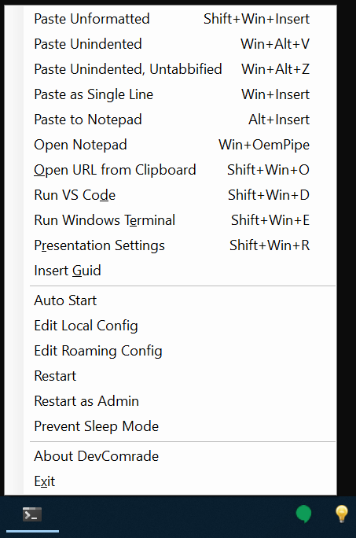

# Introduction 
**DevComrade** is a Windows copy/paste and launcher productivity tool for developers. 

Pasting code from StackOverflow or numerous blogs can be a tedious and sometimes even a dangerous task. Did that ever happened to you, when you would past some text into a Terminal command line, and it would instantly execute as a command, only because it had CR/LF at the end of the clipboard text? Or, have you ever been annoyed with some broken formatting, indentation, inconsistent tabs/spaces when you paste some code into a blog post or an email message? With a typical solution to that being to fire up Windows Notepad and use it as a buffer for copy/paste?

One other thing is Windows Shell custom keyboard shortcuts. It's a common struggle to find a convenient hotkey combination that still can be assigned to run a custom app (e.g., it's impossible to use <kbd>Win</kbd>+<kbd>Shift | Alt | Ctrl</kbd>+<kbd>Key</kbd> combos). And when it *can* be assigned, [it may take up to 10 seconds](https://superuser.com/q/426947/246232) for the program to actually start when the hotkey is pressed. 

**DevComrade** is aimed to solve these problems. It allows assigning a customizable action to (almost) any hotkey combination, and comes with an extensive set of predefined actions for pasting text and launching apps. Additional actions can be added as [C# scriptlets](https://github.com/dotnet/roslyn/wiki/Scripting-API-Samples).

When it comes to pasting text, **DevComrade** is different from some similar utilities (e.g., from the still excellent [Puretext](https://stevemiller.net/puretext/)) in that it uses [Win32 simulated input API](https://docs.microsoft.com/en-us/windows/win32/api/winuser/nf-winuser-sendinput) to elaboratively feed the text into the currently active window, character-by-character, as though it was actually typed by a person. For example, it works well with Google's [Secure Shell App Chrome extension](https://chrome.google.com/webstore/detail/secure-shell-app/pnhechapfaindjhompbnflcldabbghjo?hl=en). 

**DevComrade** is a free and open-source software licensed under [Apache License 2.0](https://www.apache.org/licenses/LICENSE-2.0). It's built with [.NET Core 3.1 SDK](https://dotnet.microsoft.com/download/dotnet-core/thank-you/sdk-3.1.302-windows-x64-installer) and uses Windows Forms for its very simple, context-menu-style UI. 

It is still very much a work in progress. Some CI logic for publishing a Chocolatey package (including a signed executable) will be implemented soon. 

Meanwhile, feel free to clone this repo, compile it and try it out:

```
dotnet publish -r win10-x64 -c Release
```
Then run `.\DevComrade\bin\Release\netcoreapp3.1\win10-x64\DevComrade.exe`

Once run, it shows up as  icon in the system tray. Some of the features to try out:

- Press <kbd>Win</kbd>+<kbd>F10</kbd> to see the list of the available shortcuts and actions.
- Copy some code into Clipboard and try <kbd>Alt</kbd>+<kbd>Ins</kbd> to paste into the internal Notepad. 
- Press <kbd>Shift</kbd>+<kbd>Win</kbd>+<kbd>E</kbd> to open Windows Terminal then <kbd>Win</kbd>+<kbd>Ins</kbd> to paste the Clipboard's content as a single line of text. It won't get executed until your press <kbd>Enter</kbd>.
- Copy any URL into clipboard (e.g., from a console window output, spaces and broken lines are OK), then press <kbd>Shift</kbd>+<kbd>Win</kbd>+<kbd>O</kbd> to open it in your default web browser.

Oh, and don't hesitate to [follow the author on Twitter](https://twitter.com/noseratio) for any updates, if interested :)



*This page will be updated soon.*

<!---
# Getting Started
TODO: See above, Guide users through getting your code up and running on their own system. In this section you can talk about:
1.	Installation process
2.	Software dependencies
3.	Latest releases
4.	API references

# Build and Test
TODO: Describe and show how to build your code and run the tests. 

# Contribute
TODO: Explain how other users and developers can contribute to make your code better. 

If you want to learn more about creating good readme files then refer the following [guidelines](https://docs.microsoft.com/en-us/azure/devops/repos/git/create-a-readme?view=azure-devops). You can also seek inspiration from the below readme files:
- [ASP.NET Core](https://github.com/aspnet/Home)
- [Visual Studio Code](https://github.com/Microsoft/vscode)
- [Chakra Core](https://github.com/Microsoft/ChakraCore)

--> 