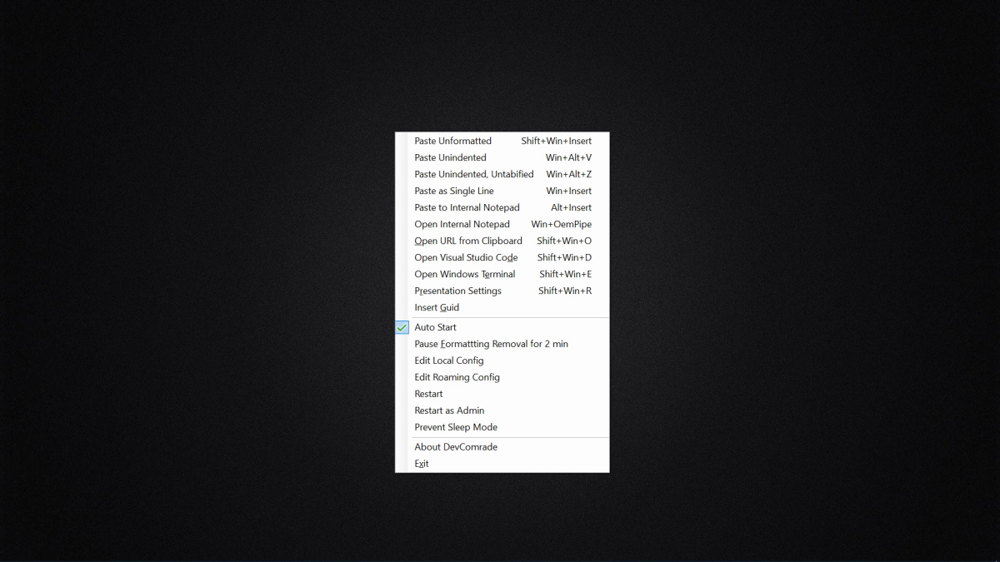
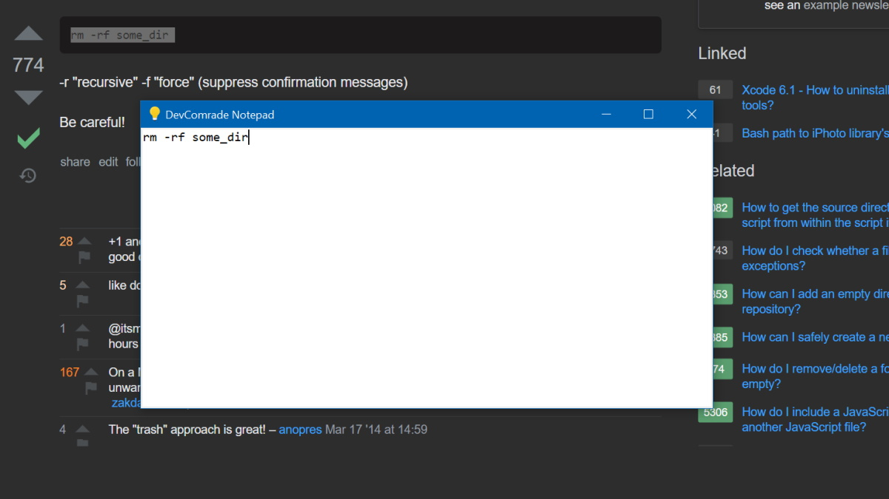

# What is it?

`DevComrade` is a free and open-source Windows copy/paste/run productivity improvement tool for developers. 

# What's new

- Simply use <kbd>Ctrl</kbd>+<kbd>V</kbd> for pasting plain text system-wide (or any other default keyboard shortcut / menu command for pasting, specific to your currently open application).
<br>`DevComrade` now monitors Windows Clipboard for text with rich formatting and replaces it with plain text by default (using [Win32 Clipboard Monitoring API](https://docs.microsoft.com/en-us/windows/win32/dataxchg/using-the-clipboard#monitoring-clipboard-contents)). This behavior can be controlled by the <kbd>Win</kbd>+<kbd>F10</kbd> menu or via the [`.config` file](https://github.com/postprintum/devcomrade/blob/main/DevComrade/App.config).
- The buit-in Clipboard Notepad:
  - Press <kbd>Alt</kbd>+<kbd>Ins</kbd> to edit the Clipboard text with DevComrade's built-in Notepad.
  - Press <kbd>Control</kbd>+<kbd>Enter</kbd> to close the built-in Notepad and save its content into the Clipboard.
  - Press <kbd>Esc</kbd> to close it without saving.
- Press <kbd>Win</kbd>+<kbd>Shift</kbd>+<kbd>Ins</kbd> to paste text with all spaces and line-breaks removed (e.g., for pasting a credit card or bank account details). As a reminder, <kbd>Win</kbd>+<kbd>Ins</kbd> pastes with only line-breaks removed.
- Updated to use .NET 5.0

# Introduction

Copy-pasting from the online docs, StackOverflow or numerous blogs can be a tedious and sometimes even a dangerous task. Does the following sound familiar: you paste some text from a web page into a Terminal command line, and it gets executed immediately, before you even have a chance to edit it? Only because there was a CR/LF character at the end of the clipboard text.

Or, have you ever been annoyed with some broken formatting, indentation, inconsistent tabs/spaces when you paste a piece of code into Visual Studio Code editor, a blog post or an email message? A typical workaround for that is to use the good old `Notepad.exe` as a buffer.

Now I have two dedicated hotkeys for that, **<kbd>Win</kbd>+<kbd>Ins</kbd> (paste as single line) and <kbd>Ctrl</kbd>+<kbd>Shift</kbd>+<kbd>Ins</kbd> (paste as multiple lines)**, which uniformly work across all apps and browsers. It also removes the trailing empty lines and the last line's CR/LF ending, so nothing gets automatically executed.

One other source of disappointment for me has always been how custom keyboard hotkeys work with Windows Shell shortcuts. It is a common struggle to find a convenient hotkey combination that still can be assigned to start a custom app. E.g., it is impossible to use <kbd>Win</kbd>+<kbd>Shift|Alt|Ctrl</kbd>+<kbd>Key</kbd> combos for that. And when it *can* be assigned, [it may take up to 10 seconds](https://superuser.com/q/426947/246232) for the program to actually start when the hotkey is pressed.

`DevComrade` has been made to solve this problem, too. It allows assigning a customizable action to (almost) any hotkey combination, and comes with an extensive set of predefined actions for pasting text and launching apps. 

Additional actions can be added as [C# scriptlets](https://github.com/dotnet/roslyn/blob/master/docs/wiki/Scripting-API-Samples.md) in the [`.config` file](https://github.com/postprintum/devcomrade/blob/main/DevComrade/App.config). E.g., generating a GUID:

```XML
<hotkey name="InsertGuid" menuItem="Insert &amp;Guid" isScript="true">
    <!-- this is an example of a C# scriptlet handler -->
    <![CDATA[
        await Host.FeedTextAsync(Guid.NewGuid().ToString("B").ToUpper(), Token);
    ]]>
</hotkey>
```

When it comes to pasting text, `DevComrade` is different from many similar utilities (e.g., from the still-excellent [Puretext](https://stevemiller.net/puretext/)) in how it uses [Win32 simulated input API](https://docs.microsoft.com/en-us/windows/win32/api/winuser/nf-winuser-sendinput) to elaborately feed the text into the currently active window, character by character as though it was typed by a person. For example, it works well with Google's [Secure Shell App Chrome extension](https://chrome.google.com/webstore/detail/secure-shell-app/pnhechapfaindjhompbnflcldabbghjo?hl=en).

`DevComrade` is a free and open-source software licensed under [Apache License 2.0](https://www.apache.org/licenses/LICENSE-2.0). It's built with [.NET 5.0 SDK](https://dotnet.microsoft.com/download/dotnet/5.0) and uses Windows Forms for its very simple, context-menu-style UI. 

**It is still very much a work in progress**. Some CI logic for publishing a Chocolatey package (including a code-signed executable) will be implemented soon and this page will be updated. Meanwhile, to build and run from the source:

# To try it out from the source code: 

- Download and install [.NET 5.0 SDK](https://download.visualstudio.microsoft.com/download/pr/475b587c-e586-4187-8feb-a602f3c6b449/b82433e88760e76d2ab591530e0784b9/dotnet-sdk-5.0.300-win-x64.exe), if you haven't got it installed already. That's the only needed prerequisite tool. Visual Studio or Visual Studio Code aren't required to build this app.

- Download and unzip [the source](https://github.com/postprintum/devcomrade/archive/main.zip), or use `git` to clone the repo to a folder of your choice, e.g.:
    ```
    mkdir DevComradeRepo && cd DevComradeRepo
    git clone https://github.com/postprintum/devcomrade .
    ```
- Build and run:
    ```
    .\Package\make-and-run.bat
    ```
- Or do that manually:
    ```
    dotnet publish -r win10-x64 -c Release --self-contained false -p:PublishTrimmed=false .\DevComrade
    
    start .\DevComrade\bin\Release\net5.0-windows7\win10-x64\DevComrade.exe 
    ```
Once run, `DevComrade` shows up as  icon in the system tray. Some of the features to try out:

- Press <kbd>Win</kbd>+<kbd>F10</kbd> to see the list of the available shortcuts and actions.
- Copy some code into the Clipboard and try <kbd>Alt</kbd>+<kbd>Ins</kbd>, to see it pasted into the instant internal Notepad pop-up window. Press <kbd>Esc</kbd> to simply hide it when finished, or <kbd>Win</kbd>+<kbd>&#x5c;</kbd> to open it again. 
- Press <kbd>Shift</kbd>+<kbd>Win</kbd>+<kbd>E</kbd> to open Windows Terminal then <kbd>Win</kbd>+<kbd>Ins</kbd> to paste the Clipboard's content as a single line of text. It won't get executed until your press <kbd>Enter</kbd>.
- Copy any URL into clipboard (e.g., from a console window output, spaces and broken lines are OK), then press <kbd>Shift</kbd>+<kbd>Win</kbd>+<kbd>O</kbd> to open it in your default web browser.

This tool has been working well for my own personal needs, but outside that its future depends on your feedback. Feel free to [open an issue](https://github.com/postprintum/devcomrade/issues) or [send me a DM on Twitter](https://twitter.com/noseratio).

<hr>



<hr>



<!---
# Getting Started
TODO: See above, Guide users through getting your code up and running on their own system. In this section you can talk about:
1.	Installation process
2.	Software dependencies
3.	Latest releases
4.	API references

# Build and Test
TODO: Describe and show how to build your code and run the tests. 

# Contribute
TODO: Explain how other users and developers can contribute to make your code better. 

If you want to learn more about creating good readme files then refer the following [guidelines](https://docs.microsoft.com/en-us/azure/devops/repos/git/create-a-readme?view=azure-devops). You can also seek inspiration from the below readme files:
- [ASP.NET Core](https://github.com/aspnet/Home)
- [Visual Studio Code](https://github.com/Microsoft/vscode)
- [Chakra Core](https://github.com/Microsoft/ChakraCore)

--> 
