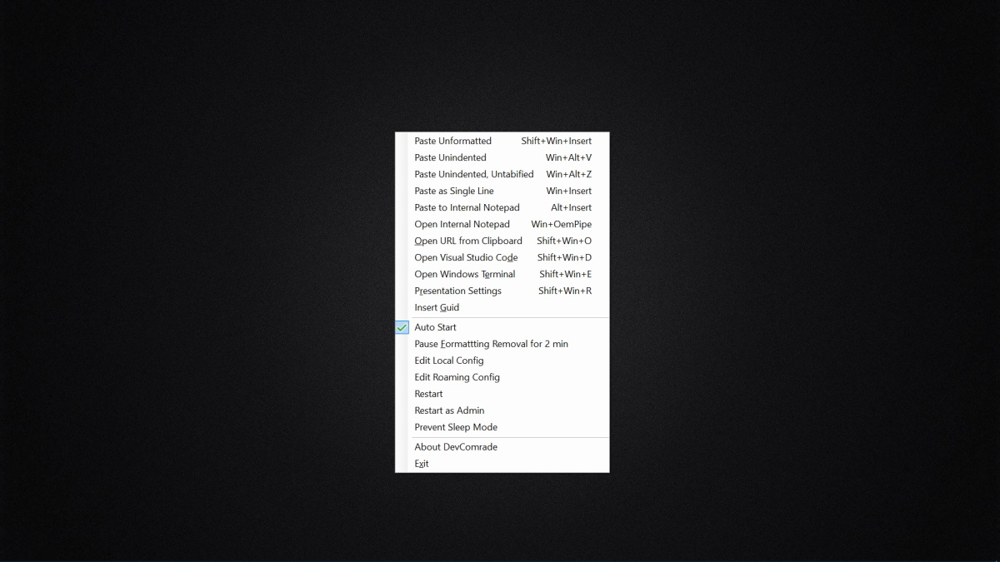
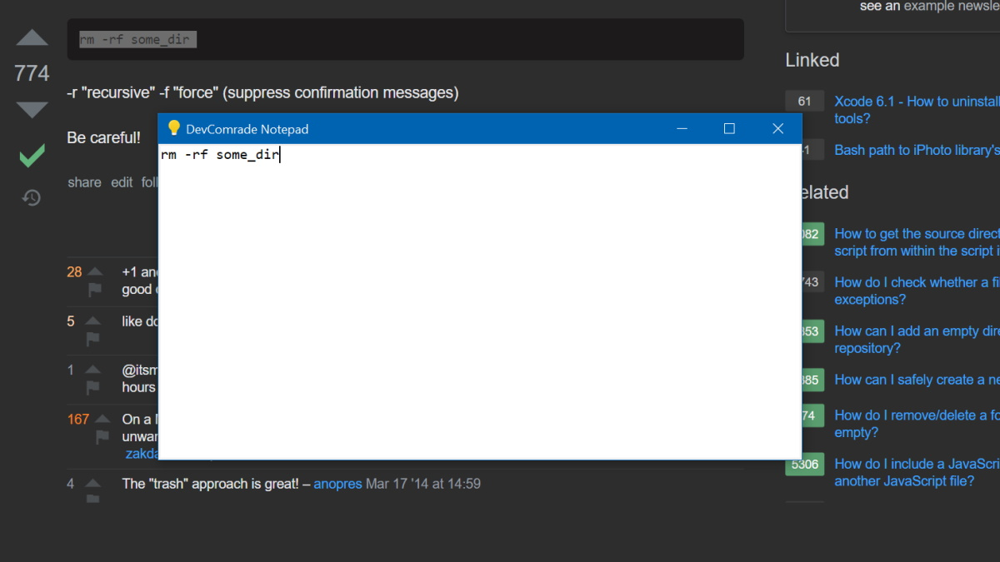

# DevComrade

`DevComrade` is a free and open-source tool for Windows. It runs in the system tray. It gives you hotkeys that paste clean text and hotkeys that start applications.

`DevComrade` helps with these usual problems:

- You copy text from a web page. When you paste it, the text keeps unwanted fonts and colors.
- You paste a command into a terminal. The text ends with a line break. The terminal runs the command before you can examine it.
- You paste code into an editor, a chat, or an email. The indentation is not correct.



## What DevComrade does

- **It removes formatting from the clipboard.** `DevComrade` uses the [Win32 clipboard monitoring API](https://docs.microsoft.com/en-us/windows/win32/dataxchg/using-the-clipboard#monitoring-clipboard-contents) to examine the clipboard. When you copy text that has formatting from HTML, RTF, PDF, or Word, `DevComrade` replaces it with plain text. Then <kbd>Ctrl</kbd>+<kbd>V</kbd> pastes plain text in all applications. To turn this function on or off, use **Remove Clipboard Formatting** in the tray menu.
- **It pastes with special hotkeys.** For example, <kbd>Win</kbd>+<kbd>&#92;</kbd> pastes the clipboard text as one line, with no line break at the end. A terminal does not run this text until you press <kbd>Enter</kbd>.
- **It has an internal Notepad.** Use it to examine or change the clipboard text before you paste it.
- **It starts applications with hotkeys.** Windows Shell shortcuts have limits. For example, you cannot use a <kbd>Win</kbd>+<kbd>Alt</kbd>+<kbd>Key</kbd> combination, and a shortcut [can be slow to start](https://superuser.com/q/426947/246232). `DevComrade` hotkeys do not have these limits.

`DevComrade` does not collect telemetry. It does not make network calls.

## Requirements

- Windows 10 or newer.
- The [.NET 10.0 SDK](https://dotnet.microsoft.com/download/dotnet/10.0), to build the program. You do not need Visual Studio or Visual Studio Code.
- [Windows Terminal](https://aka.ms/terminal) and [Visual Studio Code](https://code.visualstudio.com/), if you want to use the default hotkeys that start them.

## How to build and start the program

There is no binary release. Build the program from the source code. Do these steps:

1. Install the [.NET 10.0 SDK](https://dotnet.microsoft.com/download/dotnet/10.0).
2. Get the source code:
    ```
    git clone https://github.com/postprintum/devcomrade
    cd devcomrade
    ```
    You can also download and unzip [the source](https://github.com/postprintum/devcomrade/archive/main.zip).
3. Build the program and start it:
    ```
    .\Package\make-and-run.bat
    ```
    You can also do these two steps yourself:
    ```
    dotnet publish -r win-x64 -c Release --self-contained .\DevComrade
    start .\DevComrade\bin\Release\net10.0-windows\win-x64\publish\DevComrade.exe
    ```

`DevComrade` has no main window. After it starts, it shows the  icon in the system tray.

To start `DevComrade` each time you sign in to Windows, select **Auto Start** in the tray menu.

## First test

Do these steps to see the main functions:

1. Press <kbd>Win</kbd>+<kbd>F10</kbd>. The menu shows all the actions and their hotkeys.
2. Copy some code from a web page. Press <kbd>Shift</kbd>+<kbd>Alt</kbd>+<kbd>Win</kbd>+<kbd>&#92;</kbd>. The internal Notepad opens and shows the code as plain text.
3. Press <kbd>Esc</kbd> to close the Notepad. Press <kbd>Win</kbd>+<kbd>Alt</kbd>+<kbd>P</kbd> to open it again. The text stays.
4. Press <kbd>Win</kbd>+<kbd>Alt</kbd>+<kbd>E</kbd> to open Windows Terminal. Press <kbd>Win</kbd>+<kbd>&#92;</kbd> to paste the clipboard text as one line. The terminal does not run the text until you press <kbd>Enter</kbd>.
5. Copy a URL that has line breaks in it. Press <kbd>Win</kbd>+<kbd>Alt</kbd>+<kbd>U</kbd>. The URL opens in your web browser.

## Default hotkeys

The [`App.config`](DevComrade/App.config) file sets these hotkeys:

| Hotkey | Action | Function |
| --- | --- | --- |
| <kbd>Win</kbd>+<kbd>&#92;</kbd> | `PasteAsSingleLine` | Pastes the clipboard text as one line, with no formatting. |
| <kbd>Ctrl</kbd>+<kbd>Win</kbd>+<kbd>&#92;</kbd> | `PasteShellCommandAsSingleLine` | Pastes a multi-line shell command as one line. Removes the trailing `\` or `` ` `` continuation characters first. |
| <kbd>Win</kbd>+<kbd>Alt</kbd>+<kbd>&#92;</kbd> | `PasteUnformatted` | Pastes the clipboard text with no formatting. Keeps the line breaks. |
| <kbd>Win</kbd>+<kbd>Alt</kbd>+<kbd>N</kbd> | `PasteAsNumber` | Pastes only the digits and the decimal points. Use it for a credit card number or a bank account number. |
| <kbd>Shift</kbd>+<kbd>Alt</kbd>+<kbd>Win</kbd>+<kbd>&#92;</kbd> | `PasteToNotepad` | Puts the clipboard text into the internal Notepad. |
| <kbd>Win</kbd>+<kbd>Alt</kbd>+<kbd>P</kbd> | `OpenNotepad` | Opens the internal Notepad. Does not change its text. |
| <kbd>Win</kbd>+<kbd>Alt</kbd>+<kbd>U</kbd> | `OpenUrl` | Finds the first `http://` or `https://` URL in the clipboard text and opens it in your web browser. Removes line breaks first. |
| <kbd>Win</kbd>+<kbd>Alt</kbd>+<kbd>O</kbd> | `RunVSCode` | Activates Visual Studio Code. If it is not open, starts it in the current folder. |
| <kbd>Win</kbd>+<kbd>Alt</kbd>+<kbd>E</kbd> | `RunWindowsTerminal` | Activates Windows Terminal. If it is not open, starts it in the current folder. |
| <kbd>Shift</kbd>+<kbd>Alt</kbd>+<kbd>Win</kbd>+<kbd>E</kbd> | `RunWindowsTerminalAsAdmin` | Starts Windows Terminal as an administrator. |
| <kbd>Win</kbd>+<kbd>F10</kbd> or <kbd>Win</kbd>+<kbd>Alt</kbd>+<kbd>.</kbd> | `ShowMenu` | Opens the `DevComrade` menu. |

These actions have no default hotkey. Start them from the menu:

| Action | Function |
| --- | --- |
| `PasteUnindented` | Pastes the clipboard text. Removes the indentation. |
| `PasteUnindentedUntabified` | Pastes the clipboard text. Removes the indentation and changes the tabs to spaces. |
| `ConvertToPreformattedHtml` | Puts a `<pre>` tag around the clipboard text. Use it to paste code into a Microsoft Teams chat as HTML. |
| `InsertGuid` | Types a new GUID, for example `{ED9C4E5F-1B2A-4C3D-9E8F-0A1B2C3D4E5F}`. |
| `PresentationSettings` | Starts the Windows `PresentationSettings.exe` program. |

You can change all hotkeys in the configuration. See [Configuration](#configuration).

## The internal Notepad

The internal Notepad is a small text editor for the clipboard:

- Press <kbd>Shift</kbd>+<kbd>Alt</kbd>+<kbd>Win</kbd>+<kbd>&#92;</kbd> to open the Notepad with the clipboard text.
- Press <kbd>Ctrl</kbd>+<kbd>Enter</kbd> to close the Notepad and copy its text to the clipboard.
- Press <kbd>Esc</kbd> to close the Notepad. The clipboard does not change. The text stays in the Notepad.



## The tray menu

Click the tray icon, or press <kbd>Win</kbd>+<kbd>F10</kbd>, to open the menu. The menu shows all configured actions. It also has these items:

| Item | Function |
| --- | --- |
| **Auto Start** | Starts `DevComrade` each time you sign in to Windows. |
| **Remove Clipboard Formatting** | Turns the clipboard monitor on or off. `DevComrade` keeps your choice in the Roaming config. |
| **Edit Local Config** | Opens the Local config file. |
| **Edit Roaming Config** | Opens the Roaming config file. Makes the file first, if it does not exist. |
| **Restart** | Stops the program and starts it again. Do this after you change a config file. |
| **Restart as Admin** | Starts the program again as an administrator. Windows does not let a normal program send keystrokes to an administrator window. To paste into an administrator window, use this item first. |
| **Exit** | Stops the program. |

## How DevComrade pastes text

`DevComrade` does not use the standard paste operation for its paste hotkeys. It uses the [Win32 simulated input API](https://docs.microsoft.com/en-us/windows/win32/api/winuser/nf-winuser-sendinput) to send the text to the active window, character by character, as keystrokes. To the application, the text looks typed, not pasted. Because of this, the paste hotkeys also work in applications where the standard paste has problems, for example the Google [Secure Shell Chrome extension](https://chrome.google.com/webstore/detail/secure-shell/iodihamcpbpeioajjeobimgagajmlibd?hl=en).

## Configuration

`DevComrade` reads two config files:

- **The Local config.** This is the `DevComrade.dll.config` file in the same folder as `DevComrade.exe`. It comes from [`App.config`](DevComrade/App.config) in the source code. A new build replaces this file.
- **The Roaming config.** This file is in your Windows user profile, under `%APPDATA%`. A new build does not replace it. Put your own settings here. To open or make this file, select **Edit Roaming Config** in the tray menu.

The Roaming config has precedence over the Local config:

- For an option: if the Roaming config sets an option, that value wins.
- For hotkeys: precedence applies to the action name, not to each element. If the Roaming config has one or more `hotkey` elements with a given `name`, those elements replace **all** Local elements with that `name`. Thus, to change the hotkeys of an action, put all its hotkeys in the Roaming config.

Restart `DevComrade` after you change a config file.

### Options

The `<options>` section has these settings:

| Option | Function | Default |
| --- | --- | --- |
| `removeClipboardFormatting` | Turns the clipboard monitor on (`true`) or off (`false`). The **Remove Clipboard Formatting** menu item writes this option to the Roaming config. | `true` |
| `currentFolder` | The folder that `DevComrade` uses as its current folder. `RunVSCode` and `RunWindowsTerminal` open this folder. | `%USERPROFILE%` |
| `playNotificationSound` | Plays a sound when an action is complete (`true` or `false`). | `true` |
| `notifySound` | The path of the `.wav` file for the notification sound. | `%windir%\Media\Windows Notify.wav` |
| `tabSize` | The number of spaces for one tab. `PasteUnindentedUntabified` uses this value. | `2` |

### Hotkey elements

The `<hotkeys>` section connects actions to key combinations and menu items. A `hotkey` element has these attributes:

| Attribute | Necessary | Function |
| --- | --- | --- |
| `name` | Yes | The name of the action. It must be the same as a method name in [`PredefinedHotkeyHandlers.cs`](AppLogic/Presenter/PredefinedHotkeyHandlers.cs). |
| `menuItem` | No | The text for the tray menu. If you do not set it, the action does not show in the menu. |
| `mods` | No | The modifier keys: Alt = 1, Ctrl = 2, Shift = 4, Win = 8. Add the values together. For example, `0x9` is Win+Alt. See [RegisterHotKey](https://docs.microsoft.com/en-us/windows/win32/api/winuser/nf-winuser-registerhotkey). |
| `vkey` | No | A [virtual key code](https://docs.microsoft.com/en-us/windows/win32/inputdev/virtual-key-codes), or a character between single quotation marks, for example `'G'`. |
| `hasSeparator` | No | Set this to `true` to put a separator line after the menu item. |

If you do not set `mods` and `vkey`, the action has no hotkey. You can still start it from the menu.

This example gives the `InsertGuid` action a menu item and the hotkey <kbd>Win</kbd>+<kbd>Alt</kbd>+<kbd>G</kbd>:

```XML
<hotkey name="InsertGuid" menuItem="Insert &amp;Guid" mods="0x9" vkey="'G'" />
```

### More than one hotkey for one action

To give an action more than one hotkey, add a `hotkey` element for each key combination. Use the same `name` in each element. The default configuration does this for `ShowMenu`:

```XML
<hotkey name="ShowMenu" mods="0x8" vkey="0x79"/>
<hotkey name="ShowMenu" mods="0x9" vkey="0xBE"/>
```

Both <kbd>Win</kbd>+<kbd>F10</kbd> and <kbd>Win</kbd>+<kbd>Alt</kbd>+<kbd>.</kbd> now open the menu.

Set `menuItem` on only one of the elements. If you set it on more than one element, the menu shows the action more than one time.

## How to add a new action

The actions are C# methods in [`PredefinedHotkeyHandlers.cs`](AppLogic/Presenter/PredefinedHotkeyHandlers.cs). They compile into the program. To add your own action, do these steps:

1. Open [`PredefinedHotkeyHandlers.cs`](AppLogic/Presenter/PredefinedHotkeyHandlers.cs).
2. Add a public method. The method name is the name of your action.
3. Put the `[HotkeyHandler]` attribute on the method.
4. Build the program again.
5. Add a `hotkey` element with the same `name` to the config file.

Your method must have the same parameters as this example:

```csharp
[HotkeyHandler]
public async Task InsertGuid(Hotkey _, CancellationToken token)
{
    var text = Guid.NewGuid().ToString("B").ToUpper();

    await Host.FeedTextAsync(text, token);
    Host.PlayNotificationSound();
}
```

The `Host` property gives you the services of the program. `Host` is an [`IHotkeyHandlerHost`](AppLogic/Presenter/IHotkeyHandlerHost.cs):

- `Host.FeedTextAsync` types text into the active window.
- `Host.GetClipboardText` and `Host.SetClipboardText` read and write the clipboard.
- `Host.ShowNotepad` opens the internal Notepad.
- `Host.PlayNotificationSound` tells the user that the action is complete.

The `token` parameter is a `CancellationToken`. `DevComrade` cancels this token when the program stops. Give the token to each asynchronous method that you call.

## License and feedback

The [Apache License 2.0](https://www.apache.org/licenses/LICENSE-2.0) applies to `DevComrade`. See the [LICENSE](LICENSE) file.

To report a problem or to ask for a function, please [open an issue](https://github.com/postprintum/devcomrade/issues).
